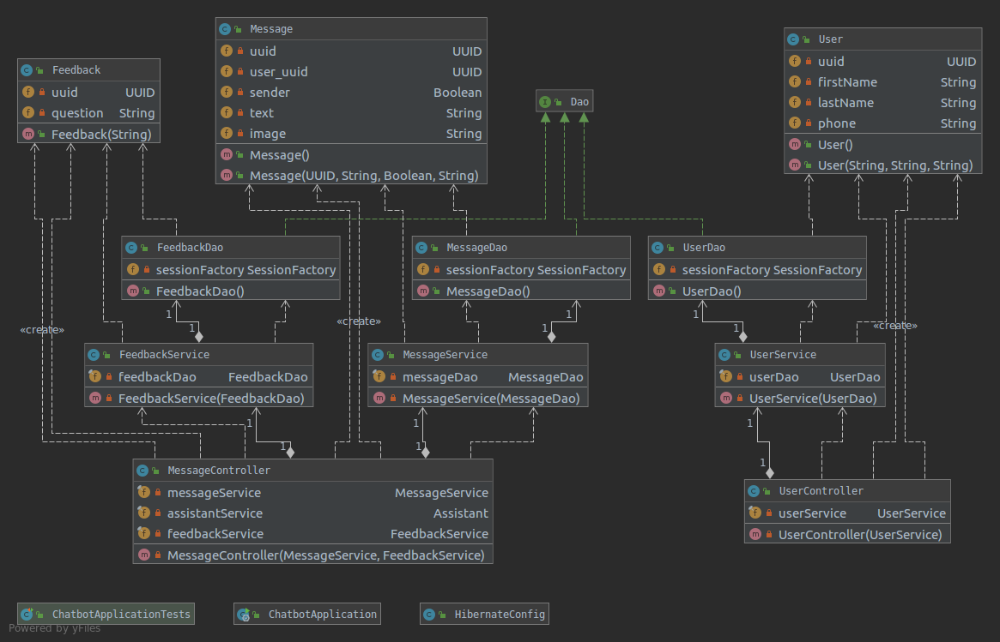

# DEVELOPER GUIDE

## 1. Introduction
AyudaPe is an extension/complement to the Yape application that will act as a chatbot for answering a user when a question (related to Yape) is presented. AyudaPe will receive a question/query, parse it, retrieve the answer from a database and show it. It will use Java, Javascript and SpringBoot for back-end, the React JavaScript library for front-end, Amazon Relational Database Service (RDS) and Amazon Elastic Compute Cloud (EC2) from Amazon Web Services and MariaDB for the implementation of the database, and finally use Hibernate as a mean to communicate to said database.

## 2. Features

**Reynaldo Rojas(30%), Nicolas Chipana(70%):** UI 
- v1.2: Implement message box UI: Using CSS it is possible to change the dimensions of the message box depending on the size of the message.
- v1.3: Scrolling message: Using React it is possible to change the current layout of an HTML to react to a certain action. In this case, sending or receiving a message from AyudaPe will scroll the screen proportionally to the size of the message.
- v1.4: Touchable questions: Using React it is possible to call a back-end function after touching an item. In this case, after touching an option in the chat the described action will call a function that retrieves information from the database to show.

**Reynaldo Rojas(100%):** Send messages to watson
- v1.2: Initial backend and frontend setup. Created AWS RDS MariaDB instance.
- v1.3: Endpoint in backend that receives requests and then connects to the Watson API to get an appropiate response.
- v1.4: Call endpoint from React using axios.
- v2.0: AWS EC2 setup and backend deployment. AWS Amplify frontend deployment.

**Rodrigo Bedoya (100%):** tracking questions without answers 
- v1.2: Save all messages in file. Load all messages from file 
- v1.3: Save / load only recent messages. 
- v1.4: Can choose to clear history / select after how much time history should be cleared. 
- v2.0: Show older messages as user goes up.

**Reynaldo Rojas (100%):** feedback option
- v2.0: Receive feedback from hojar via email

**Joe Acuña (34%), Bryan Díaz (33%), Juan Navarro (33%):** process question feature 
- v1.2 Integration with Watson Assistant API.
- v1.3 Train model to display list of functionalities. 
- v1.4 Add websockets support.
- v2.0 Train model to answer more question.

## 3. Design

### 3.1. Architecture

#### 3.1.1 Component Diagram

#### 3.1.2. Class Diagram
This class diagram corresponds to the back-end and it is only used to storage the history.

#### 3.1.3. Interaction Between Components

### 3.2 Use Case Diagram

## 4. FAQ

What if there is no internet connection, can I ask my doubts to AyudaPe?
- No, AyudaPe works with the User's internet connection to interact with Watson's API and answer messages.

## 5. Glossary

**User Interface (UI)**: Medio por el cual el usuario interactúa con el dispositivo. En este caso serán los botones y entradas de texto de la aplicación.

**User Experience (UX)**: Se refiere a la calidad de la interacción desde la perspectiva del usuario.

**Lenguaje Natural**: Es cualquier lenguaje humano que ha evolucionado naturalmente con el uso.

**Chatbot**: Programa que recibe como entrada texto que al cual nos referimos como lenguaje natural y, posteriormente, retorna una salida acorde. Cuenta con un *UI*.

**Protocolo de comunicación**: Es un sistema de reglas que permite que dos o más entidades de un sistema de comunicación puedan intercambiar información.

**HTTP/1.1**: Uno de los *protocolos de comunicación* más usados en Internet.

**Application Programming Interface(API)**: Conjunto de rutinas de un programa a las cuales se puede acceder mediante protocolos de comunicación tales como **HTTP/1.1**.

**Request**: Es un pedido que se le hace a un programa, este puede ser de varios tipos. Los efectos pueden ser diversos dependiendo del tipo.

**Client**: Envía *requests* a un *server*.

**Server**: Espera requests de algún *client* y retorna *responses* acorde.

**Response**: Simplificando bastante, se entiende como la respuesta del *server* al *client* como efecto de haber recibido un *request*.

**Watson Assistant**: Es un *API* a la que se le envía un texto en un lenguaje natural el cual es procesado por otro programa que, ha sido entrenado para reconocer patrones de frases; posteriormente, recibe el resultado del análisis, y procesa este resultado para finalmente enviar un *response* al *client*.

**Front-end**: La implementación de un diseño de un *UI*.

**Back-end**: La implementación de los procedimientos que se deben seguir la aplicación.

**Transmission Control Protocol (TCP)**: Es uno de los protocolos principales que componen a Internet.

**Websocket**: Es un *protocolo de comunicación* que provee una comunicación en dos direcciones al mismo tiempo mediante una conexión *TCP*.

**Plataforma**: Es el entorno en el que se ejecuta una pieza de software.

**Cloud computing service**: Provee tecnología como servicio a través de internet o una red dedicada.

**Amazon Web Services (AWS)**: Es una plataforma de *cloud computing services*.

**Lenguaje de programación**: Lenguaje formal utilizado para implementar programas.

**Javascript**: Lenguaje de programación utilizado para implementar la parte lógica del *front-end*.

**Status Code**: Indica si un *request* ha sido completado o no.

**Controller**: Procesa el *request* y realiza acciones sobre los *models*.

**Model**: Maneja la información, lógica y reglas de la aplicación.

**Database (DB)**: Es una colección de datos organizada.

**Object Oriented Programming (OOP)**: Es un paradigma de programación que se basa en objetos. Estos objetos pueden contener información y poseer rutinas, conocidas como métodos.

**Lenguaje de programación orientado a objetos**: Lenguaje de programación que implementa *OOP*.

**Object-relational Mapping (ORM)**: Es una técnica utilizada para convertir información entre sistemas usando un *lenguaje de programación orientado a objetos*.

**Java**: Es un lenguaje de programación orientado a objetos. Se utilizará para implementar el back-end de la aplicación.

**Hibernate ORM**: Es una herramienta que implementa *ORM* y puede ser utilizada con *Java*.

**JSX**: Es un lenguaje de programación orientado a objetos el cual posteriormente se traduce a *Javascript*. Se utilizará en conjunto con *React* para la implementación del *front-end*.

**Librería**: Conjunto de implementaciones utilizadas por un programa.

**React**: Librería de *Javascript* utilizada para construir el *UI* y la lógica del *front-end*.

**Markup Language**: Lenguaje que usa etiquetas para definir elementos en un documento.

**Cascading Style Sheets (CSS)**: Es un lenguaje usado para describir la presentación de un documento escrito en un *markup language*.

**Hyper Text Markup Language (HTML)**: Es un *markup language* utilizado para describir la estructura de una página web.

**Framework**: Es una abstracción que provee funcionalidades genéricas las cuales pueden ser implementadas por el usuario.

**Spring Boot**: Programa que facilita la implementación de una aplicación basada en la plataforma Spring.
