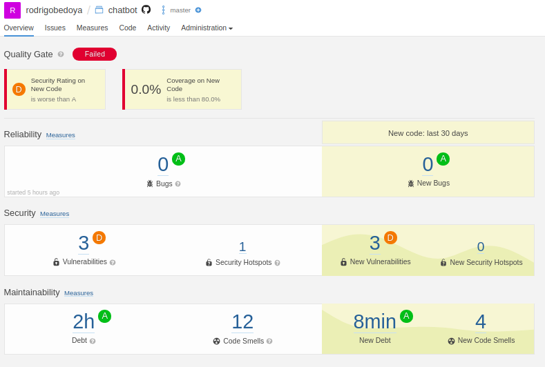

# AyudaPe
# Participants
- Joe Acuña
- Nicolás Chipana
- Rodrigo Bedoya
- Bryan Diaz
- Reynaldo Rojas

# Demo
To run the project is necessary to execute the **run.sh** script in root.
```
./run.sh
```

# SonarQube Quality Check
## Front End (JavaScript)

## Back End (Java)

